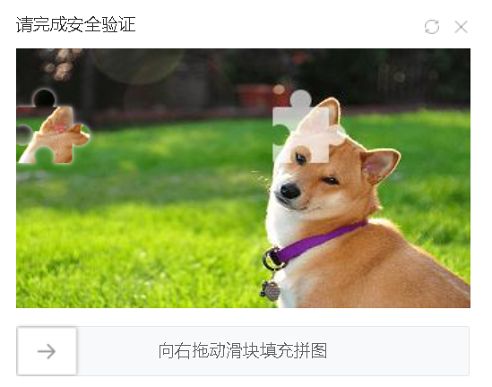

## 1. PhotoLetterVerification：图片字母识别

以识别四个字母的验证码为例，如下图所示：

文件夹提供了识别该类型验证码的sdk（verifySDK.py），根据具体情况进行修改。

ocr采用的是dddocr包，这里封装在了ocr文件夹下，由于gitee/github上传文件的大小限制，模型没有上传，需要自己去下载。

具体地有：common_det.onnx,   common_old.onnx,   common.onnx   三个模型

## 2. SliderVerification：滑块验证码

体验链接：[滑动验证码demo (10jqka.com.cn)](http://activity.10jqka.com.cn/acmake/cache/304.html?sessionId=221.4.34.152&info=&groupId=website_basic&isPc=true&reqType=&returnUrl=https%3A%2F%2Fgitee.com%2Fsmart-finance%2Fcrawler%2Fwikis%2F%E7%88%AC%E8%99%AB%E9%9C%80%E6%B1%82%3Fsort_id%3D4255492&acHost=%2F%2Fbasic.10jqka.com.cn&sessionId=221.4.34.152&info=&groupId=website_basic&isPc=true&reqType=&returnUrl=https%3A%2F%2Fgitee.com%2Fsmart-finance%2Fcrawler%2Fwikis%2F%E7%88%AC%E8%99%AB%E9%9C%80%E6%B1%82%3Fsort_id%3D4255492&acHost=%2F%2Fbasic.10jqka.com.cn)

模型在checkpoints文件夹下，由于gitee/github上传文件的大小限制，模型（yolov3_ckpt_pretrain.pth）没有上传，需要自己下载（图片识别）。